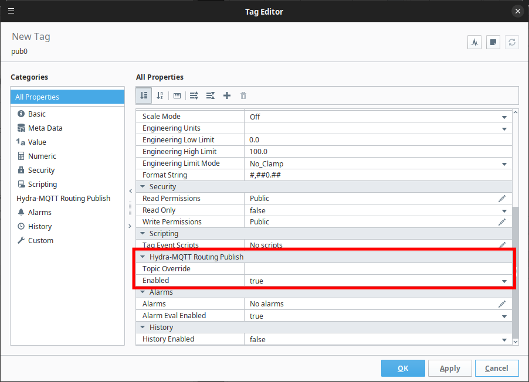

# Publish Topic Suffix

This option:

1. Appends the specified suffix to the `Topic` when publishing `Tag` changes.
2. Ignores received events from `Topic`s with the specified suffix.

This is intended help prevent a `Subscribe-Only Tag Provider` from receiving data published by a `Publish-Only Tag Provider`.

???+ example

	```text title="Publish Topic Suffix"
	_write
	```

# Publish Tag Properties Enabled

This option enables properties in the `Tag Editor Window` which override default options for the `Publish-Only Tag Provider` when publishing `Tag` changes.

| Property       | Value     | Effect                                                                                          |
|----------------|-----------|-------------------------------------------------------------------------------------------------|
| Topic Override | Empty     | Use the default `Tag Path`/`Topic`. `Publish Topic Suffix` will be appended (default behavior). |
| Topic Override | Not Empty | Use the specified `Tag Path`/`Topic`. `Publish Topic Suffix` will be ignored (not appended).    |
| Enabled        | true      | Changes to the `Tag` will automatically publish to the broker (default behavior).               |
| Enabled        | false     | Changes to the `Tag` will never publish to the broker.                                          |



