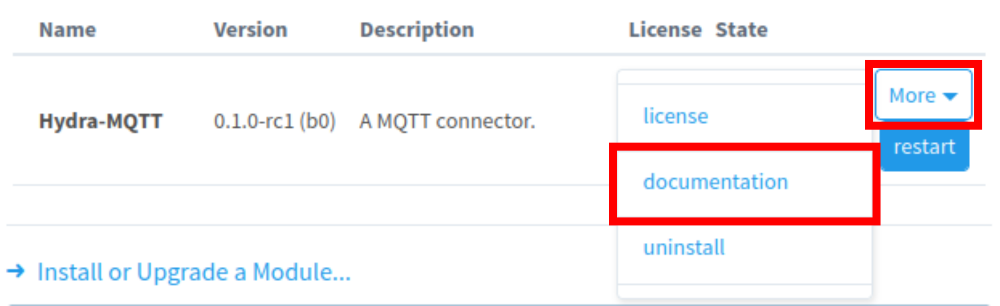
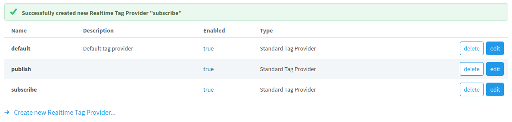
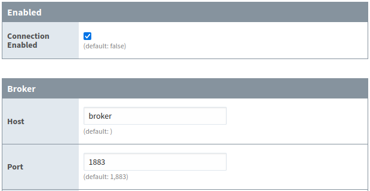
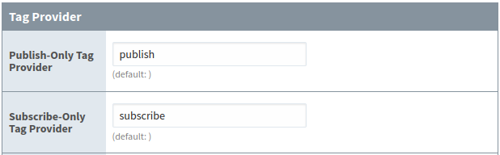
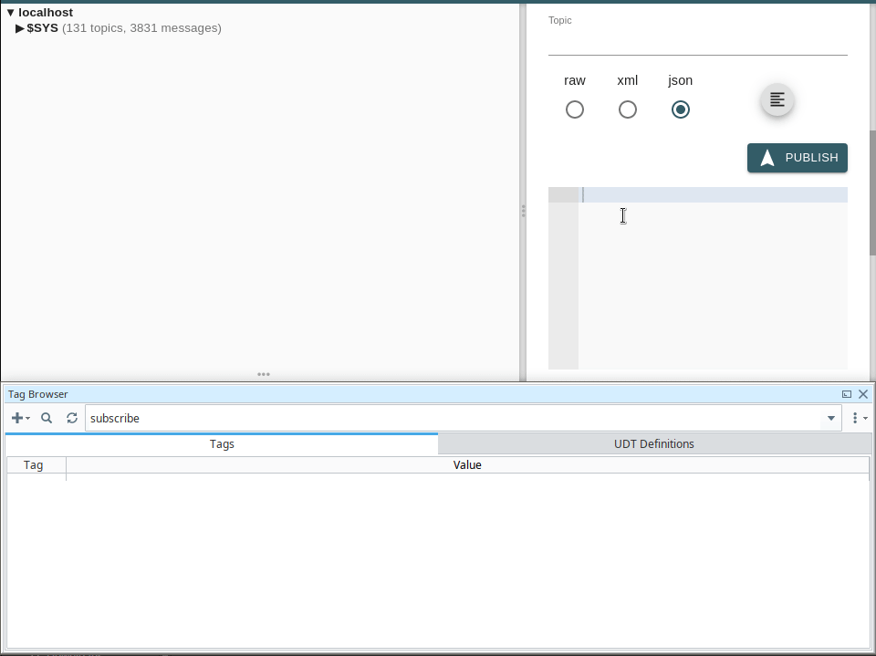
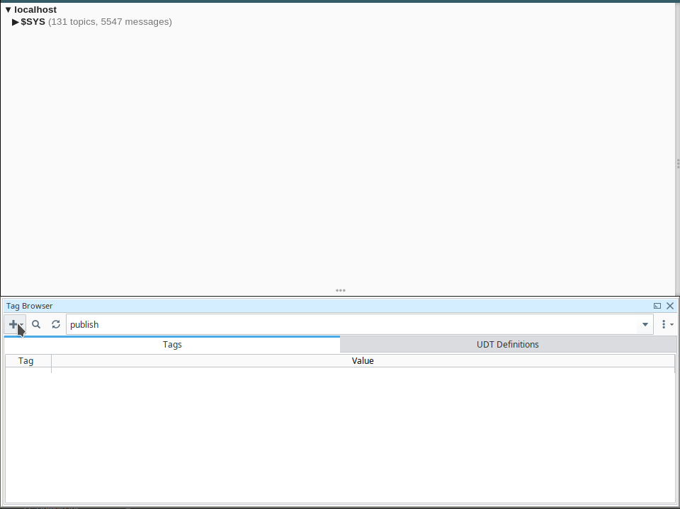

# Documentation

This documentation is built into the module and can be accessed through the gateway by navigating to
`Config > System > Modules` and clicking on `More > Documentation` as illustrated in the figure below.
Having documentation built into the module ensures that you always have access to documentation for the
specific version of the module that you are running. In addition, this ensures that you always have
access to documentation, even in environments where you have access to a gateway but do not have access
to the internet.

<figure markdown="span">
  
  <figcaption>Built-In Documentation</figcaption>
</figure>

In addition, online documentation for the latest release and latest pre-release can be accessed via:

- [Latest Release Documentation](https://hydra-mqtt.netlify.app/)
- [Latest Pre-Release Documentation](https://hydra-mqtt-prerelease.netlify.app/)


# Required Materials

To get started, the following materials are needed:

- [Inductive Automation Ignition](https://inductiveautomation.com/)
- A MQTT Broker
- [MQTT Explorer](https://github.com/thomasnordquist/MQTT-Explorer/releases)
- [Hydra-MQTT](https://github.com/m-r-mccormick/Hydra-MQTT/releases)

To simplify getting up and running, the following `docker-compose` stacks are provided:

??? example "Docker-Compose: Ignition with Insecure Mosquitto Broker"

    [Download mosquitto-insecure.zip](./docker/mosquitto-insecure.zip)

    - Log in to Ignition gateway via [http://localhost:8088](http://localhost:8088)
        - username: `admin`
        - password: `password`
    - For testing purposes only, to disable Ignition automatic logout due to inactivity, set
        `Config > Security > General > User Inactivity Timeout` to `0`.
    
    ```yaml title="Files" 
    [Root]
    └─mosquitto:
    │ └─mosquitto.conf
    └─docker-compose.yml
    ```

??? example "Docker-Compose: Ignition with Insecure EMQX Broker"

    [Download emqx-insecure.zip](./docker/emqx-insecure.zip)

    - Log in to Ignition gateway via [http://localhost:8088](http://localhost:8088)
        - username: `admin`
        - password: `password`
    - For testing purposes only, to disable Ignition automatic logout due to inactivity, set
        `Config > Security > General > User Inactivity Timeout` to `0`.
    - Log in to EQMX web interface if needed via [http://localhost:18083](http://localhost:18083)
        - username: `admin`
        - password: `password`
    
    ```yaml title="Files" 
    [Root]
    └─emqx:
    │ └─acl.conf
    │ └─emqx.conf
    └─docker-compose.yml
    ```


# Subscribing and Publishing

Once you have the required materials up and running, log into the Ignition gateway.

First, navigate to `Config > Tags > Realtime` and create two tag providers by clicking on 
`Create new Realtime Tag Provider`.

- Tag Provider 1: `subscribe`
- Tag Provider 2: `publish`

<figure markdown="span">
  
  <figcaption>Real-Time Tag Providers</figcaption>
</figure>

Next, navigate to the `Connection` configuration at `Config > Hydra-MQTT > Connection`.
Then, input the following options:

- `Enabled > Connection Enabled`: `true`
- `Broker > Host`:
    - If you manually installed the MQTT broker on your machine: `localhost`
    - If you are using the provided docker-compose stacks: `broker`
- `Tag Provider > Publish-Only Tag Provider`: `publish`
- `Tag Provider > Subscribe-Only Tag Provider`: `subscribe`

<figure markdown="span">
  
  <figcaption>Enabled and Broker Settings</figcaption>
</figure>

<figure markdown="span">
  
  <figcaption>Tag Provider Settings</figcaption>
</figure>

Then, scroll to the bottom of the page and click `Save Changes`.

Next, open an instance of the Ignition Designer (the `Get Designer` button in the top right corner of the gateway).
When connecting, create a new project called `Hydra`. Switch the Designer Tag Browser to view the `subscribe`
tag provider, and publish messages using MQTT Explorer as shown below.


<figure markdown="span">
  
  <figcaption>Subscribe-Only Tag Provider</figcaption>
</figure>

As you can see, Hydra-MQTT automatically translates the topic structure from the MQTT broker into Ignition folders and 
tags in the `subscribe` tag provider.

Next, switch to the `publish` tag provider in the Ignition Designer Tag Browser, and add folders and tags as shown
below.

<figure markdown="span">
  
  <figcaption>Publish-Only Tag Provider</figcaption>
</figure>

Inverse to the `subscribe` tag provider, Hydra-MQTT automatically translates the directory structure of the
`publish` tag provider into an equivalent topic structure in the MQTT broker.

It's that easy.

???+ quote

    __"Data In, Data Out!"__ - _Industry 4.0 Mr. Miyagi_

