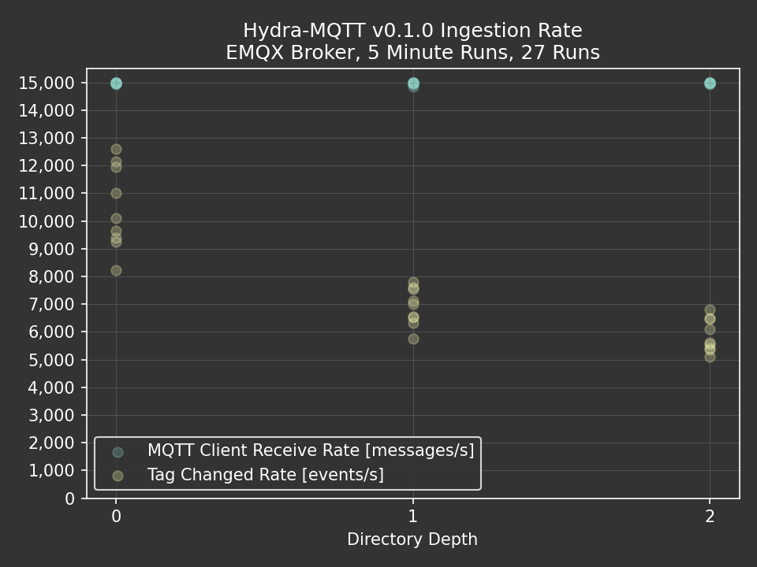
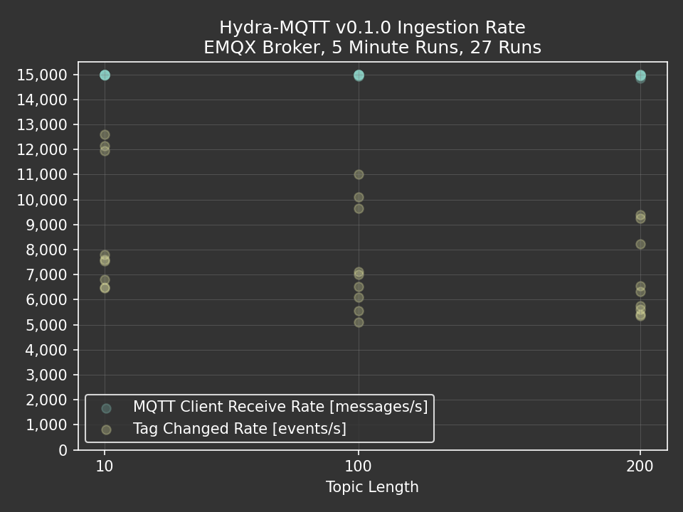
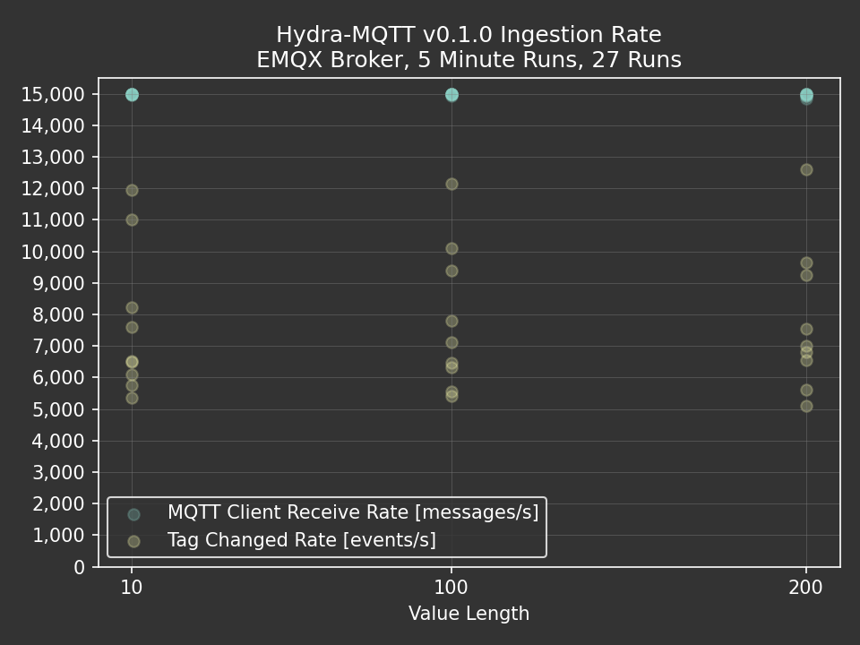
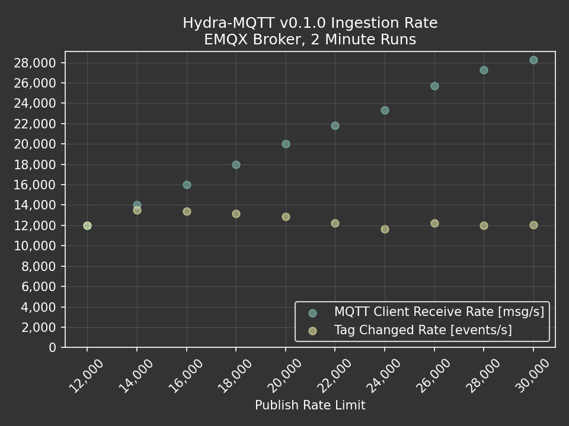

# Benchmark Method

The following are preliminary benchmark results which were __not__ performed in a scientifically rigorous manner.
No effort has been put into improving the ingestion performance of Hydra-MQTT to date.
The intent of these performance metrics is to:

1. Inform end users of the current performance limitations of Hydra-MQTT.
2. Establish the current performance for quantitative comparison to future improvements.

Two metrics were captured during benchmark trials:

1. `MQTT Client Receive Rate [msg/s]`: The number of MQTT messages received from the broker per second.
2. `Tag Changed Rate [events/s]`: The number of Tag Changed events that fire after values have been written to the
        Ignition tag engine. In other words, after data has passed through and back out of the Ignition tag engine.

A buffer is between the MQTT client which is receiving messages and the Ignition tag engine to absorb bursts of
messages which would otherwise overwhelm Hydra-MQTT's current ability to create and write values to tags. Since
these two metrics are decoupled by the buffer between them:

- `MQTT Client Receive Rate [msg/s]` is a measure of burst performance (high rate for a short duration)
- `Tag Changed Rate [events/s]` is a measure of sustained performance (long duration)

Benchmark trials were full-factorial parameterized based on random data generated with three input parameters at 
three levels:

- `Directory Depth`: The number of parent folders created in the Tag Provider, or the number of `/`s in the topic.
- `Topic Length`: The number of characters in the tag path (without Tag Provider name), or the length of the topic (including `/`s).
- `Value Length`: The number of characters in a `String` value in the payload.


```json title='Payload Structure'
{
  "Value": "[String of length 'Value Length']"
}
```

Data integrity was not quantified. All trials were run with a subscribe QoS of 0.

# Results

The following results were generated on a single computer using:

- A python script publishing pre-generated random data to the broker.
- Ignition 8.1.45 (In docker container)
- EMQX 5.8.4 (In docker container)
- Hydra-MQTT v0.1.0

## Directory Depth

These trials were run with a publish rate limit of 15,000 msg/s.



## Topic Length

These trials were run with a publish rate limit of 15,000 msg/s.



## Value Length

These trials were run with a publish rate limit of 15,000 msg/s.



## Rate Limit

These trials were run with the following parameters and varying publish rate limits:

- `Directory Depth`: 0
- `Topic Length`: 10
- `Value Length`: 10



# Conclusions

- Hydra-MQTT v0.1.0 is not suitable for environments with constant throughput exceeding 5,000 msg/s.
- Tag write performance is the current bottleneck for Hydra-MQTT v0.1.0 ingestion throughput. This should be an area
        of focus and starting point for future performance improvements.
- Hydra-MQTT v0.1.0 is capable of absorbing bursts in excess of 28,000 msg/s for at least 2 minutes, provided that
        enough Random Access Memory (RAM) is allocated to store buffered messages while they are written to the
        tag engine.
- Python will likely not be adequate for generating and publishing test data for future benchmarks after performance
        is improved and where more throughput is required to stress the system. During benchmark trials, python
        struggled to publish in excess of 28,000 msg/s.
