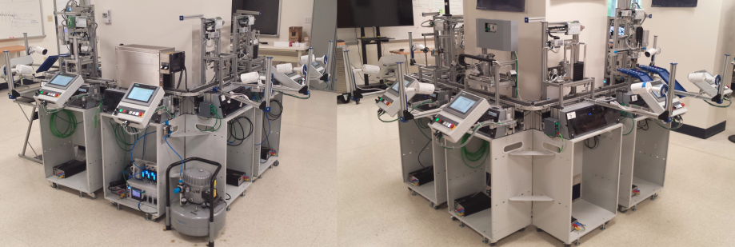

Are you looking to take Hydra-MQTT to the next level, but aren't ready to deploy it in a production environment?

Or, are you looking to utilize authentic manufacturing data rather than using a simulator?

[Real-Time Manufacturing Datasets (RTMD)](https://github.com/m-r-mccormick/Real-Time-Manufacturing-Datasets){target=_blank}
is a educational resource which provides streaming, authentic manufacturing datasets from multiple physical testbeds.
In addition, it provides pre-configured tooling (i.e., docker-compose stacks) and accelerates the utilization of 
provided datasets.

Since RTMD is pre-configured to utilize Hydra-MQTT, it is a useful resource for learning to use this module.

<figure markdown="span">
  
  <figcaption>Proof of Concept Dataset Testbed</figcaption>
</figure>
